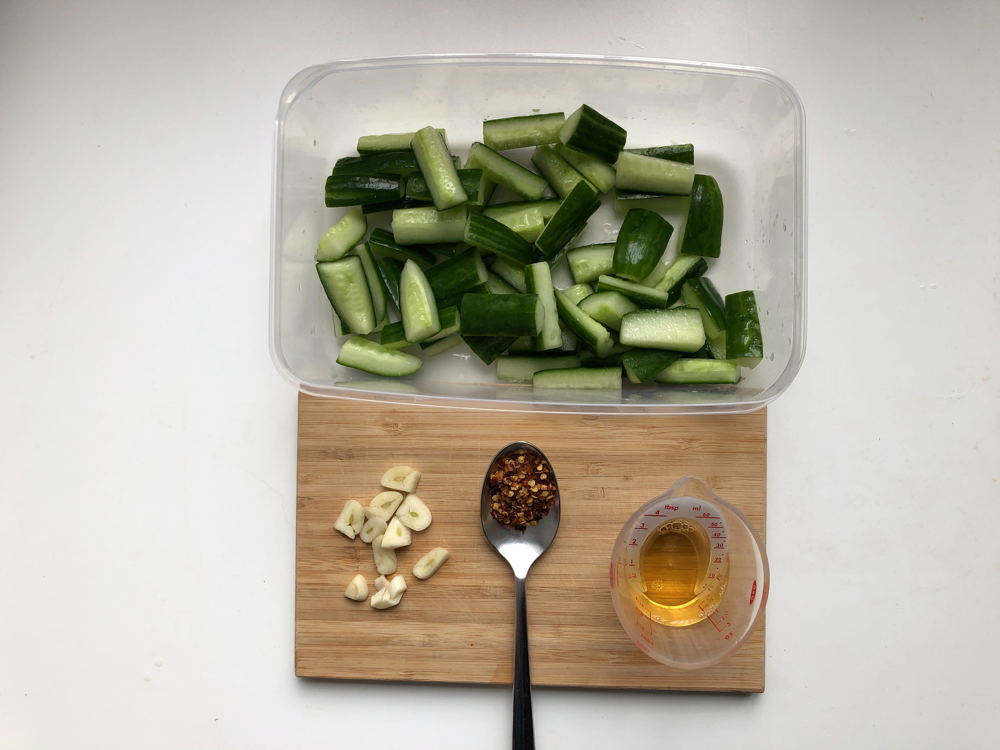
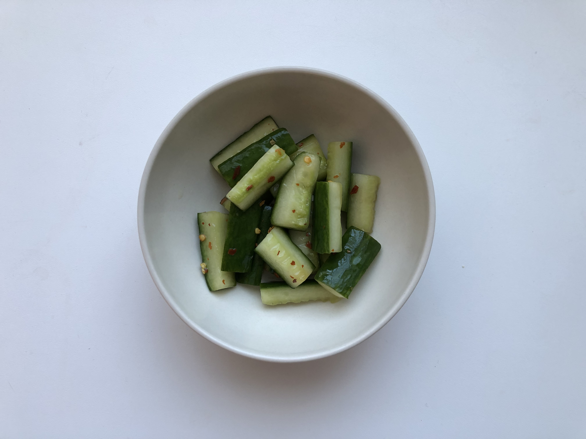

# Spicy cucumber

## Ingredients

- 1 Cucumber
- 1 teaspoon Chili flakes
- 3 toes Garlic
- 30ml Apple Vinegar (or regular vinegar with some sugar)
- ½ teaspoon Salt

## Step

1. Cut the cucumber, remove the middle parts with a small spoon
1. Mix salt and cucumbers and wait for 20 mins to dehydrate the cucumber
1. Drain the water
1. Take off the garlics peel by crushing it with a big knife and then chop it into coarse pieces
1. Mix in the garlic, chili flakes and vinegar
1. Stir them well and put them in a closed container\
  _Tip: Use a wide container to make sure all cucumber are soaked in the sauce_
1. Put the container in the fridge and stir once in a while
1. After one day, enjoy the tasty spicy cucumber!

